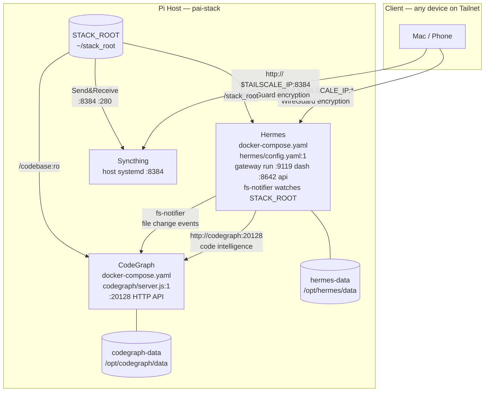
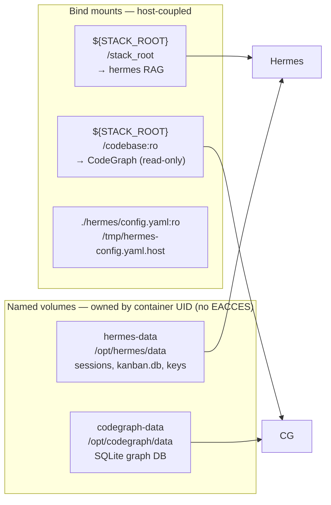
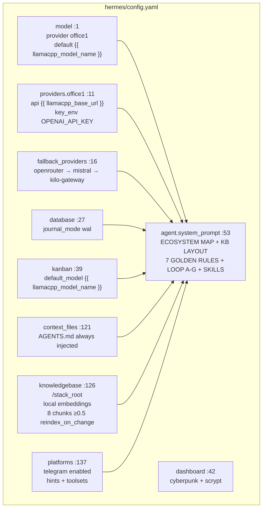
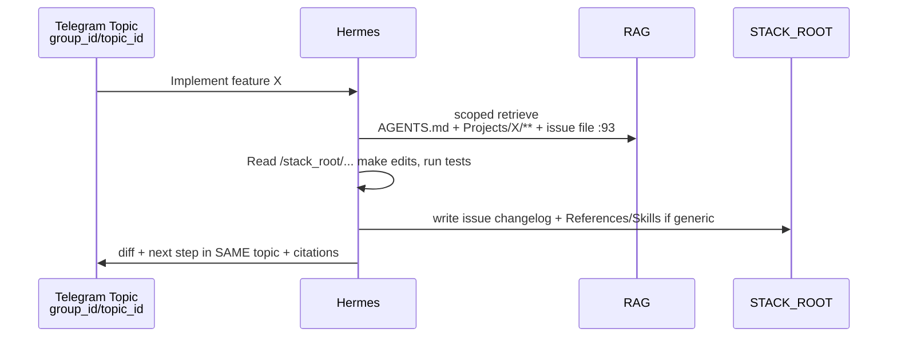

# pai-stack — Design & Blueprint

> **Status:** Accepted — reflects `main` at 2026-09-04. Single source of truth for architecture, decisions, and philosophy. Update this file on any structural change and add an ADR under `docs/adr/`.

---

## 1. Vision

**pai-stack** is a personal AI infrastructure that turns a single Pi/home-server into an **operations manager for an evolving portfolio of projects**. A human lives in Telegram Forum Topics; Hermes thinks in markdown KB — and gets better at software planning by learning across projects without leaking project data.

**One command to rebuild from bare SSH:** `TARGET_HOST` (LAN or Tailscale IP) + `ansible-playbook` provisions Docker, Tailscale, secrets, containers, and model routing — no manual Docker bootstrap.

Tagline: **Hermes Agent + Syncthing + CodeGraph (Tailscale WireGuard)** `README.md:3`.

---

## 2. Requirements

### 2.1 Functional

| ID | Requirement |
|----|-------------|
| F1 | Chat-ops via Telegram Forum: one Forum Group per project, one Topic per issue/feature/bug; answers isolated to originating topic |
| F2 | Grounded answers: retrieve from KB before answering, cite `file:lines`, never guess beyond context |
| F3 | KB as durable memory: plain markdown at `STACK_ROOT` root is both human-readable and vector-indexed |
| F4 | Code execution: Hermes implements/researches tasks directly, writes back to KB |
| F5 | Sync: `STACK_ROOT` (`~/stack_root`) bidirectionally synced across user devices |
| F6 | Model routing: free-first LLM with failover, ability to pin paid/pro models on demand; catalog browseable |
| F7 | Self-hosted on one host, reproducible from scratch |

### 2.2 Non-Functional

| Category | Requirement | Current handling |
|----------|-------------|------------------|
| **Confidentiality** | No raw secrets in KB; access only over Tailscale | `OPENAI_API_KEY` dummy, `API_SERVER_KEY` bearer, BasicAuth on dashboards, refs like `env VAR` in markdown |
| **Availability** | Pi-grade resilience; unattended restart | `restart: unless-stopped`, healthchecks `docker-compose.yaml:55`, `umask 000` WAL fix `hermes/entrypoint.sh:23` |
| **Resource** | Fit in ~4 GB RAM on Pi | Limits: `hermes 3G`, `codegraph 512M` |
| **Latency** | Chat replies in seconds, not minutes | `auto_retrieve: true` `max_context_chunks: 8` `relevance_threshold: 0.5` + `reindex_on_change: true` `hermes/config.yaml:140` |
| **Operability** | Full rebuild <15 min from bare SSH | Ansible `common → tailscale → docker → pai_stack` `ansible/playbook.yml:8` |
| **Portability** | Move to new Pi without data loss | Named volumes `docker-compose.yaml:101` + bind mount `STACK_ROOT`, `make clean` is explicit `Makefile:37` |
| **Evolvability** | Unbounded projects, no hardcoded names | `AGENTS.md` manifest `AGENTS.md:13` + `_TEMPLATE` scaffolding `Projects/_TEMPLATE/` |

---

## 3. High-Level Architecture



**Network blueprint** `README.md:7`:
- **Outside:** only via Tailscale IP — WireGuard handles encryption. No TLS termination, no reverse proxy. No public ports.
- **Inside:** plain HTTP over Docker bridge (`hermes → codegraph:20128`). `extra_hosts: host.docker.internal:host-gateway` lets Hermes reach host Syncthing.

### 3.1 Service Inventory

| Service | Container | Ports | Auth | Purpose | Key file |
|---------|-----------|-------|------|---------|----------|
| **Hermes** | `nousresearch/hermes-agent:latest` patched `pai-stack-hermes:patched` | `9119` dash `8642` api (bound to Tailscale IP) | `HERMES_DASHBOARD_BASIC_AUTH_PASSWORD` → scrypt `hermes/entrypoint.sh:37`, `API_SERVER_KEY` bearer | Telegram bot, RAG, Kanban, fs-notifier | `hermes/config.yaml:1` |
| **CodeGraph** | `codegraph:latest` (Debian 12 + codegraph binary + Node.js) | `20128` int (Docker bridge only) | none (internal) | Code intelligence HTTP API | `codegraph/server.js:1` |
| **Syncthing** | host `syncthing serve --home=/var/lib/syncthing` | `8384` host (bound to Tailscale IP) | bcrypt `config.xml` | Sync `STACK_ROOT` | `ansible/playbook.yml` |
| **fs-notifier** | background process in Hermes container | n/a (IPC) | n/a | Watches `STACK_ROOT`, notifies CodeGraph of file changes for rebuild | `hermes/config.yaml` |

---

## 4. Data Plane



*Only host-coupled data is bind-mounted* `README.md:268`. Scaffold (`AGENTS.md`, `Projects/`, `Skills/`, `Tools/`) copied once `force: no` — user edits never overwritten.

---

## 5. Hermes — The Mind (`hermes/config.yaml:1`)

Hermes is the only stateful brain. Its behavior is governed by **one file** plus env overlay at boot. `docker-compose.yaml:64` mounts `config.yaml:ro` to `/tmp/hermes-config.yaml.host`; `hermes/entrypoint.sh:26` copies to `/opt/hermes/data/{hermes-config.yaml,config.yaml}`, hashes dashboard password, sets `HERMES_CONFIG`, then `exec /opt/hermes/docker/entrypoint-dispatch.sh gateway run` `docker-compose.yaml:69`.



### 5.1 System Prompt = Philosophy in Code `hermes/config.yaml:54`

* **Ecosystem Map:** tells Hermes where everything lives (`STACK_ROOT`, `STACK_ROOT` root, CodeGraph, Syncthing).
* **KB Layout** `hermes/config.yaml:66`:
  ```
  /stack_root/                     ← indexed entirely (STACK_ROOT)
  ├── AGENTS.md                           ← always injected `context_files:121`
  ├── Projects/<Name>/{README, docs/architecture.md, telegram.md, config.md, issues/<slug>.md}
  ├── References/                         ← cross-project growth
  ├── Skills/<skill-name>/SKILL.md
  └── Tools/
  ```
* **Golden Rules** `hermes/config.yaml:84` — see §8 Philosophy.

### 5.2 Kanban Patch `hermes/Dockerfile:3` `hermes/apply-kanban-patch.py:1`

Upstream lacks board-wide model. Patch adds `kanban.default_model` to `hermes_cli/config_defaults.py:28` + dispatcher in `hermes_cli/kanban_db.py:39`:

```
if task.model_override → -m <override> [--provider <override>]
else if kanban.default_model → -m <default> [--provider <name> if provider embedded else profile default]
else → profile model

Precedence: 1. model_override > 2. kanban.default_model > 3. profile
```

Applied via `patch -p1` with `apply-kanban-patch.py:11` regex fallback if upstream drifted; verified by `python -c assert` `hermes/Dockerfile:17`. Empty = legacy — forward-compatible.

### 5.3 RAG & Write Discipline `hermes/config.yaml:131`

- Indexes **entire** `STACK_ROOT` so `~/stack_root` is searchable even before KB scaffold.
- `local` embeddings (`all-MiniLM-L6-v2`, ~80 MB) — no external API.
- `reindex_on_change: true` → immediate retrieval after write.
- **Write rule:** Hermes writes only to `STACK_ROOT` (indexed + synced). Ensures `KB FIRST, topic second` `hermes/config.yaml:82`.

---

## 6. CodeGraph — Code Intelligence `codegraph/server.js:1`

CodeGraph provides code intelligence via HTTP API (`:20128`) using the `codegraph-ai/CodeGraph` binary in `--graph-only` mode (no ONNX embeddings, ~256MB RAM). The HTTP wrapper (`codegraph/server.js`) exposes endpoints for context, callers, callees, impact analysis, and search — all backed by a RocksDB graph stored in `codegraph-data` volume.

Key endpoints:
* `GET /context/:symbol` — full context (source, callers, callees, deps)
* `GET /callers/:symbol` / `GET /callees/:symbol` — call chain tracing
* `GET /impact/:path` — blast radius of file changes
* `GET /search?q=:query` — semantic symbol search
* `GET /map` — most-connected files overview
* `POST /query` — arbitrary codegraph CLI command

Hermes queries CodeGraph via `http://codegraph:20128` for code-aware planning and refactoring.

---

## 7. Execution Model — Hermes Works Directly

Hermes now implements tasks directly in `/stack_root` without delegate containers. `HOW TO WORK D` `hermes/config.yaml:93` reads relevant files, makes edits, runs tests, writes result to `issues/*.md` + `References/Skills` if generic, and summarizes in **same Telegram topic only** with `file:lines` citations. No MCP, no `agent-workspace` volume, no `TASK_TIMEOUT` queue.

---

## 8. Core Principles & Philosophy — Non-Negotiable

These are the **guardrails that keep Hermes from drifting** as portfolio grows. Violating any one requires an ADR.

| # | Principle | Statement | Enforced by |
|---|-----------|-----------|-------------|
| P1 | **Isolation per topic, learning across topics** `hermes/config.yaml:85` | In topic X, retrieve & answer ONLY `AGENTS.md` + `Projects/X/**` + its `issues/<slug>.md`. After completion, distill generic patterns into `References/` or `Skills/` — compound growth without leaking project data. | `system_prompt` + `AGENTS.md:29` + retrieval scoping |
| P2 | **KB first, topic second** `hermes/config.yaml:86` | Never post decision/diff to Telegram without first writing to `STACK_ROOT`. Topic is ephemeral view; KB is durable truth. Cite `file:lines`. | `system_prompt` loop A-G |
| P3 | **Ask first (hybrid)** `hermes/config.yaml:87` | Mirror & propose, but never write KB from chat without explicit confirm from that topic. | `system_prompt` + `AGENTS.md:34` |
| P4 | **Permission gate + searchable mapping** `hermes/config.yaml:88` | First message in new group/topic → record `group_id + topic_id` in `Projects/<Name>/telegram.md` + `issues/<slug>.md`. If not listed, refuse: "Not in telegram.md". | `telegram.md` `Projects/_TEMPLATE/telegram.md:1` + `AGENTS.md:24` |
| P5 | **Evolving portfolio — no hardcoded names** `hermes/config.yaml:89` | Never invent `ProjectAlpha/Beta`. On unknown project, search `~/stack_root` via RAG, create scaffold from `_TEMPLATE`, propose, wait confirm, write `Projects/<Name>/{README,docs/architecture,telegram,config}` + update `AGENTS.md`. No project limit. | `system_prompt` + `AGENTS.md:14` |
| P6 | **Secrets as references** `hermes/config.yaml:90` | Never write raw secrets to KB or git; use "API key in 1Password / env `X`". | `system_prompt` + `env.j2:1` (0600) |
| P7 | **Concise per-topic, no cross-post** `hermes/config.yaml:91` | Telegram: short bullets + citations per topic; Dashboard/API may be verbose. Never duplicate content across topics/groups. | `system_prompt` + `platform_hints.telegram` `hermes/config.yaml:149` |
| P8 | **Unified paths** | `${STACK_ROOT}` is `/stack_root` everywhere (Hermes, RAG). | `docker-compose.yaml:92` |
| P9 | **Free-first, quality on demand** `hermes/config.yaml:7` | Default chat = free combos (`personal/free-chat`) with failover. | `discover_models: true` |
| P10 | **Skills compound** `hermes/config.yaml:111` | After 2nd repeat or on "create a skill", draft `Skills/<name>/SKILL.md` directly, write to KB, retrieve next time. Generic skills are portfolio-wide. | `_TEMPLATE/SKILL.md` `Skills/_TEMPLATE/SKILL.md:1` |

**Mantra:** *You live in Telegram Topics, but think in markdown KB.*

---

## 9. Request Flows

### 9.1 Telegram Task (canonical)



### 9.2 Dashboard / API

Hermes dashboard at `:9119` (BasicAuth `admin/$HERMES_DASHBOARD_BASIC_AUTH_PASSWORD` `docker-compose.yaml:84`, hash in `hermes-data/hermes-config.yaml` `entrypoint.sh:44`) and API at `:8642` (Bearer `API_SERVER_KEY` `docker-compose.yaml:82`). Both bound to Tailscale IP directly — WireGuard provides encryption.

### 9.3 Syncthing

`Pi ~/stack_root` canonical (`path: pai_stack_root`, `id: stack_root`, GUI `0.0.0.0:8384`, bcrypt). Host systemd binds Tailscale `100.x:22000` directly — peers discover via Device ID, optional explicit `tcp://rpi.burro-smelt.ts.net:22000` `README.md:192`. Bidirectional Send&Receive, deletes → `.stversions`.

---

## 10. Deployment & Operations

**Deploy target:** `~/deployed-pai-stack` — full repo clone on target host.

**Ansible pipeline** `ansible/playbook.yml`: flat playbook (no roles). Steps: `common` (dirs), `tailscale` (install/join via `TAILSCALE_AUTH_KEY` `.env.example:46`), `docker`, `pai_stack`.

**Configs are overwritten on every deploy** — templates are the source of truth. Secrets are preserved: `ansible/playbook.yml` reads existing `~/deployed-pai-stack/.env` → preserves secrets else generates `openssl rand -hex 32`. Templates `env.j2` (UID/GID resolved, `STACK_ROOT`, keys). Copies build contexts flat, seeds KB scaffold (`AGENTS.md`, `Projects/`, `Skills/`, `Tools/`; force: no), installs Syncthing host, configures `config.xml` (telemetry `urAccepted=-1`, folder path/ID, GUI address/auth, `.stfolder`), systemd, `docker compose up -d --build --remove-orphans`, wait `:20128`, seed combos, `restart hermes`.

**Env forwarding contract** `README.md:92`: local `.env` never copied; only `HERMES_DASHBOARD_PASSWORD`, `STACK_ROOT` forwarded as extra vars.

**Make** `Makefile:1`: `deploy`/`deploy-renew`, `logs` (`docker compose logs -f`), `status`, `stop`/`restart`, `update` (`pull && up --build`), `clean` (`down -v` — destructive, deletes volumes).

---

## 11. ADRs — Key Decisions

| ADR | Decision |
|-----|----------|
| [ADR-001: Single Pi + Compose](adr/ADR-001-single-pi-compose.md) | Compose over K8s — operability on constrained host |
| [ADR-004: Syncthing on host](adr/ADR-004-syncthing-host.md) | Host systemd vs container — Tailscale interface + canonical `~/stack_root` |
| [ADR-005: Direct execution (delegates removed)](adr/ADR-005-direct-execution.md) | Hermes implements directly; MCP delegates retired |
| [ADR-006: Local embeddings + file RAG](adr/ADR-006-local-rag.md) | fastembed on whole `Personal` vs vector DB service — simplicity + privacy |
| [ADR-007: Ansible provisioning](adr/ADR-007-ansible-provisioning.md) | Ansible over Terraform — bare-SSH to full stack, secret preservation |

Each ADR follows template: Status, Context, Decision, Alternatives, Consequences, Trade-offs. See `docs/adr/`.

---

## 12. Trade-offs & Constraints

* **Simplicity > horizontal scale:** single host, no sharding; scaling = bigger Pi then split services.
* **Consistency > write scale:** WAL SQLite for Kanban (one writer, many readers); fixed with `umask 000` `hermes/entrypoint.sh:23`.
* **Cost > peak quality:** free-first combos; paid pin when needed.
* **Durability > convenience:** named volumes + explicit `make clean`; KB is plain files under `STACK_ROOT` (`STACK_ROOT`).

---

## 13. Risks & Mitigations

| Risk | Impact | Mitigation |
|------|--------|------------|
| Pi disk failure | Lose volumes in `/var/lib/docker/volumes` | `tar czf` busybox export `README.md:322`; KB already Syncthing-synced off-host |
| WAL read-only regression | Kanban event stream warnings | `entrypoint.sh:23` fix + `find chmod a+rw` back-fix; re-applies on deploy |

| Upstream Hermes image drift | Patch fails | `apply-kanban-patch.py:11` fallback + `docker logs` verification `hermes/Dockerfile:17` |
| Tailscale key expiry | New Pi can't join | Manual `TAILSCALE_AUTH_KEY` `ansible/playbook.yml` + SSH via LAN `TARGET_HOST` `.env.example:4` |

---

## 14. Security

* No public ports — all via Tailscale WireGuard encryption.
* Secrets in target `~/deployed-pai-stack/.env 0600`, generated via `openssl rand` if blank, preserved on re-deploy. `SSH_PASSWORD`/`BECOME_PASSWORD` never copied to target `.env.example:71`.
* Syncthing GUI bcrypt 12 — bound to Tailscale IP directly.
* KB secret refs only `hermes/config.yaml:90` — audit `References/` and `config.md`.

---

## 15. How to Keep Philosophy Intact — Contributor Guide

1. **Edit `hermes/config.yaml:53` `system_prompt` first** — that's the constitution. Every new capability must fit Ecomap → Golden Rules → Loop.
2. **Add a project = scaffold, not hardcode:** mention in chat → Hermes searches `Personal` → creates from `_TEMPLATE` → update `AGENTS.md` and `telegram.md`. Never add `if project==X` in code.
3. **New automation = Skill:** after 2nd repeat, `Skills/<name>/SKILL.md` via `_TEMPLATE/SKILL.md` — imperative `When to use / Inputs / Steps / Outputs`.
4. **New architecture = ADR:** create `docs/adr/ADR-00N-*.md`, mark Accepted/Rejected, reference here.
5. **Verify:** `make deploy`, `make logs`, `make status`, check `http://$TAILSCALE_IP:9119` and `http://$TAILSCALE_IP:8384`.

---

## 16. References

* `README.md:1` — user-facing quickstart & network blueprint
* `hermes/config.yaml:1`, `hermes/entrypoint.sh:1`, `hermes/Dockerfile:1`, `hermes/apply-kanban-patch.py:1`
* `docker-compose.yaml:1`, `codegraph/server.js:1`
* `ansible/playbook.yml`, `ansible/templates/env.j2`, `ansible/group_vars/all.yml`
* `AGENTS.md:1`, `Projects/_TEMPLATE/`, `Skills/_TEMPLATE/SKILL.md:1`
* `Makefile:1`, `.env.example:1`
