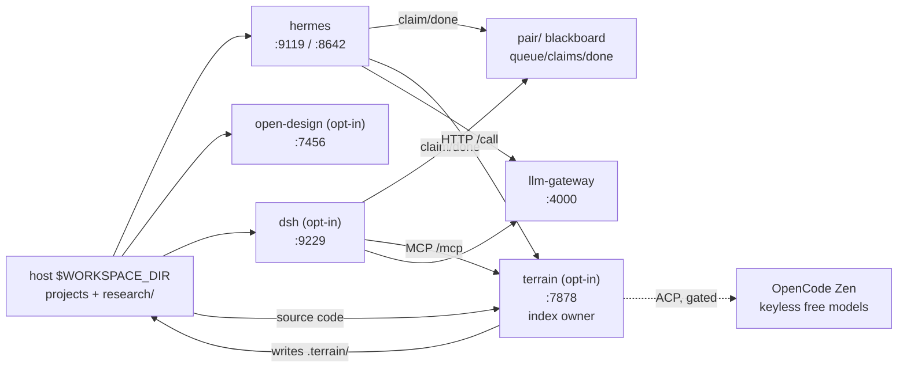
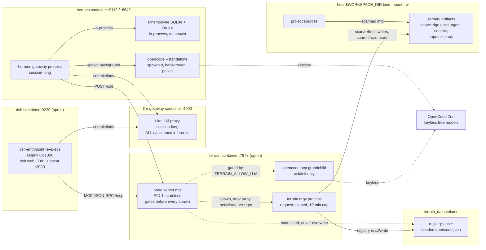
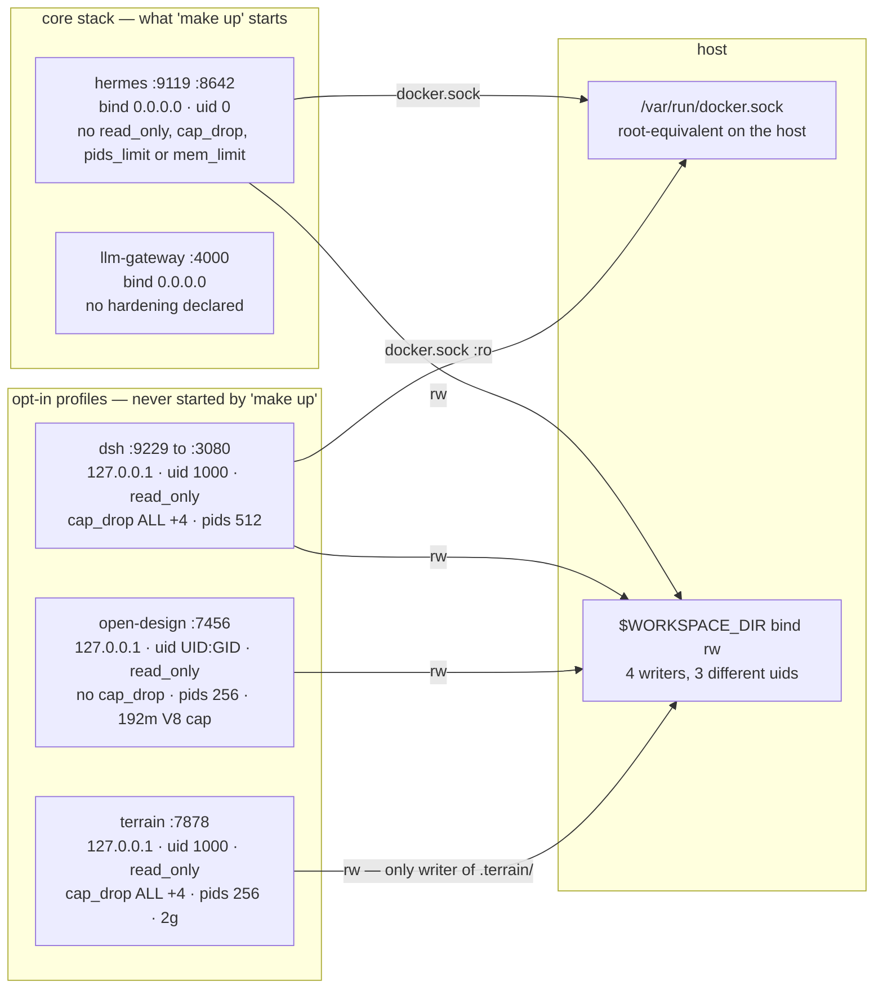

# Architecture

Two core services. Three optional profiles. One workspace mount.

```
Host $WORKSPACE_DIR
  ├── <project-a>/, <project-b>/, ...
  ├── research/            ← Research Brain vault (Markdown)
  └── .planning/           ← per-project planning artifacts
        │
        │  /opt/data/workspace (rw) ──→ hermes
        │
hermes ──→ llm-gateway:4000   (ALL model inference)
hermes ──→ in-process: pai_* tools, skills, Mnemosyne (SQLite + ONNX)
open-design (profile: design) ──→ shares $WORKSPACE_DIR at /opt/data/workspace
dsh (profile: dsh) ──→ shares $WORKSPACE_DIR at /opt/data/workspace, models via llm-gateway:4000
terrain (profile: terrain) ──→ writes .terrain/ inside each indexed repo (only writer)
hermes ──HTTP /call──┐
dsh ──MCP /mcp───────┴──→ terrain:7878
terrain ──→ opencode acp ──→ OpenCode Zen free models (keyless; NO llm-gateway link)
```

## System map



## Process model

The same system seen by **OS process** rather than by service. Three lifetimes —
boot, session, request — and one rule that explains the rest:

> No agent process ever holds a resident index. That is what moved code
> intelligence out of the agents' heaps and into a container of its own
> ([terrain.md](terrain.md)).

| Lifetime | Process |
|---|---|
| boot → exec | `hermes-entrypoint.sh` → `gateway run`; `dsh-entrypoint` → `setpriv --reuid=1000` re-exec → `dsh web` + socat |
| session-long | hermes, dsh, LiteLLM proxy, `node server.mjs` — **none of these hold an index** |
| request-scoped | `terrain argv` — one process per tool call, killed at the 10-minute cap |
| spawned lineage | `opencode acp` (terrain, LLM-gated), `opencode --standalone` (hermes delegate) |



Three consequences worth stating, because they are design decisions rather than
accidents:

- **The shim is a security process — on `/call` only.** `token → allowlist → path
  confinement → LLM gate` run before `spawn()`, with an argv array and never a
  shell. But the `TERRAIN_ALLOW_LLM` gate is **not implemented on `/mcp`**, so an
  MCP client can run `ask`/`init` at the default `TERRAIN_ALLOW_LLM=0`, which
  [terrain.md](terrain.md) claims it cannot. Per-repo serialisation keys on
  `action|path`, so `index` and `refresh` on one repo are *different* queues and
  can still interleave writes into `.terrain/`.
- **State lives where a process can be killed for free.** `.terrain/` in the repo,
  registry and seeded `opencode.json` on the `terrain_data` volume, Mnemosyne on
  `hermes-data`, sessions on `dsh_data`. `make terrain-down` costs nothing.
- **Indexing is free.** `index`/`refresh` make no LLM call and `refresh` skips
  Litho, so an agent can re-index on reflex instead of reasoning about staleness.
- **`pai_terrain_ops` is baked but not enabled.** `hermes/Dockerfile` copies it
  into the image, and it is the only baked plugin absent from `plugins.enabled` in
  `hermes/config.yaml` — so the Terrain story in AGENTS.md cannot work at runtime
  until that line lands.

## Permissions & trust boundaries



| | hermes | llm-gateway | terrain | dsh | open-design |
|---|---|---|---|---|---|
| Host bind | **0.0.0.0** | **0.0.0.0** | 127.0.0.1 | 127.0.0.1 | 127.0.0.1 |
| Container uid | **0 (root)** | image default | 1000 | 1000 | `${UID}:${GID}` |
| `read_only` rootfs | no | no | yes | yes | yes |
| `cap_drop` | — | — | `ALL` +4 caps | `ALL` +4 caps | — (none) |
| `no-new-privileges` | no | no | yes | yes | yes |
| `pids_limit` / `mem_limit` | — / — | — / — | 256 / 2g | 512 / — | 256 / — |
| `docker.sock` | **yes** — accepted | no | no | **yes** `:ro` — accepted | no |
| Workspace | rw | — | rw | rw | rw |
| Profile | core | core | `terrain` | `dsh` | `design` |

**The docker socket is a deliberate, accepted grant**, not a defect: both agents must be
able to control the host containers they own, including the optional profiles.
Scoping is by convention in the `docker` skill (pai-stack label filter vs
`docker compose -p <project>`), not by code — no tool enforces it.

**The shape of the remaining risk:** the two services with no containment are the two
that are always on *and* published on every host interface. The socket being accepted does
not neutralise it — `docker exec llm-gateway env`
prints every provider key the gateway holds. See [audit.md](audit.md).

## Mounts

| Host | Container | Service | Access |
|---|---|---|---|
| `$WORKSPACE_DIR` | `/opt/data/workspace` | hermes | read-write (code edits, research vault) |
| `$WORKSPACE_DIR` | `/opt/data/workspace` | terrain | read-write (writes `.terrain/` into the indexed repo) |
| `$WORKSPACE_DIR` | `/opt/data/workspace` | dsh | read-write (sessions operate directly on it) |
| `hermes-data` volume | `/opt/hermes/data` | hermes | app state, Mnemosyne DB, logs |
| `open_design_data` volume | `/app/.od` | open-design | daemon state (SQLite, config, artifacts index) |
| `dsh_programs` volume | `/opt/dsh` | dsh | DSH program (upgrades land here) |
| `dsh_data` volume | `/data/dsh` | dsh | sessions, configs, plugins, memory, toolchain caches |
| `/var/run/docker.sock` | `/var/run/docker.sock` | hermes | host docker daemon (root-equivalent — deliberate) |
| `/var/run/docker.sock` | `/var/run/docker.sock` | dsh | host docker daemon (root-equivalent — deliberate; agent reaches it via a `DOCKER_HOST` proxy socket, dsh is non-root) |
| `./skills` | `/opt/pai/skills` | hermes | read-only procedural skills |
| `./skills` | `/data/dsh/.agents/skills` | dsh | read-only (path verified post-boot) |

No sidecar DB or embedding containers (~2.3 GB RAM saved).

## Dual-Brain (summary)

| Brain | Backing | Role |
|---|---|---|
| Research | `pai_notebook_ops` on `research/` | RFCs, papers, API docs, notes |
| Memory | Mnemosyne (SQLite + fastembed) | Decisions, fixes, preferences, triples |

**Code intelligence is a temporary accelerator, not a dependency.** The default and
always-available path is `grep` plus targeted reads, using the agent's own tools. When the
optional [Terrain](terrain.md) profile is running it adds a shared `.terrain/` index and
`pai_terrain_ops`; when it is absent the tool **hides itself** and nothing degrades. Treat
Terrain as removable at any time — removing it means stopping a profile and deleting a
gitignored directory.

It replaced `pai_code_intel`, removed 2026-10-04: that tool registered an in-process
tree-sitter index over the whole workspace, of which measurement showed 42% was a Go
toolchain (leaked into the mount by `HOME`) and which would not fit DSH's 1.2 GB heap cap.
Moved into its own process instead — see [Process model](#process-model).

Cross-linking: `@symbol:path/to/file.ext:SymbolName` anchors in notes + Mnemosyne triples (note → symbol → decision). Full research loop: [research.md](research.md). Hermes operation: [hermes.md](hermes.md).

## LLM posture: gateway-only

- Hermes declares one provider (`gateway` → `llm-gateway:4000`). Model choice, fallbacks, credentials live in `llm-gateway/config.yaml` + `scripts/sync-models.py`.
- Never add direct provider keys or Hermes-level fallbacks. Models.dev reads are metadata-only and fine.
- Exceptions: `opencode-delegate` calls Zen free models directly (keyless, see [delegation.md](delegation.md)); Langfuse receives traces (the audit trail).
- Secrets caveat: keys are absent from the hermes container env, but `.env` sits inside the mounted workspace — file-capable tools can read it. `*.env` reads are hard-denied for delegates.

## Philosophy

- Zero contamination: research lives in `research/` or `.planning/`, never in git code dirs.
- Single gateway: every model call routes through `llm-gateway:4000`.
- Empirical over theoretical: ambiguous docs → micro-probe before trusting web claims.
- Self-realizing agent: Hermes discovers tools, skills, and boundaries on Turn 1.
