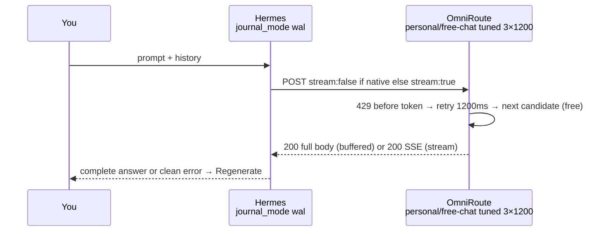

# Plan — Reliable Chat (ponytail: full) — O1 tune + O2 buffer if native

> Scope: `hermes/config.yaml:11` + `omniroute/seed-combos.sh:70` — free-only, no context loss, no mid-cut. No new deps, no new services.

## Ladder check

1. **Need it?** Yes — `r/CLine` + `BerriAI#9035` ` :free 20 RPM` cuts stream `200 → SSE error finish_reason:error` (`openrouter docs`). Hermes must keep `messages[]` in `hermes-data` `docker-compose.yaml:89` `journal_mode:wal` `hermes/config.yaml:17`.
2. **Already here?** `seed-combos.sh:70` already has `candidatePool/trackMetrics/routerStrategy/modePack` — tune it. `hermes-data` already preserves history — reuse it.
3. **Native?** OmniRoute non-stream `can fallback freely` (`AveMujica/TrueFoundry`) is native — use `stream:false` upstream if Hermes exposes it. No custom `stream_fallback_mode: prefill` (`llm-gate 0.8.0`) — that's a second system to own.
4. **One line?** O1 is one line. O2 is one boolean *if* exposed, else skip — don't build a wrapper.

## Diff (machine-runnable) — 2 files, 2 commands

```diff
# omniroute/seed-combos.sh:70 — O1 (one line)
- ...config:{maxRetries:2,retryDelayMs:2000,candidatePool:['opencode','openrouter','nvidia'],routerStrategy:'rules',trackMetrics:true,reasoningTokenBufferEnabled:true,modePack:'cost-saver',explorationRate:0.1}
+ ...config:{maxRetries:3,retryDelayMs:1200,candidatePool:['opencode','openrouter','nvidia'],routerStrategy:'rules',trackMetrics:true,reasoningTokenBufferEnabled:true,modePack:'cost-saver',explorationRate:0.05} // ponytail: 3×1200 covers chutes 429 burst, 0.05 less flaky; add health sort when retries still fail

# hermes/config.yaml:11 — O2 (native only, else no diff)
# providers:
#   omniroute: {api: http://omniroute:20128/v1, key_env: OPENAI_API_KEY, discover_models:true}
# If hermes gateway exposes `stream: false` for provider, add it — one field:
#   omniroute: {api: ..., discover_models:true, stream: false} // ponytail: native buffer; if field not in hermes_cli/config_defaults.py, skip — don't patch gateway
```

```bash
make seed            # docker compose exec omniroute /app/seed-combos.sh
docker compose restart hermes  # re-probe GET /v1/models discover_models:true hermes/config.yaml:15
```

→ skipped: sticky 30min, per-key cooldown, `/api/fallbacks/.../sort/health`, `personal/free-coding` variant, `prefill/user_turn` stitch, manual `Retry-After` queue. Add when `X-Fallback-Attempts` still hits 3 on soak.

## What this fixes (and what it doesn't)



* **Keeps context:** history stays in `hermes-data` — `hermes-agent#30998 finish_reason=length continuation` + `wal` already do this. No silent splice (LangWatch `never silent-switch mid-stream`).
* **Pre-stream 429/5xx:** now 3×1200 survives `r/CLine` Chutes `429 every ~30s`. `402/content_filter` not retried (OmniRoute `mapped_status_code`).
* **Mid-stream 429 (`200 → error` SSE):** only fixed if `stream:false` is native (OmniRoute buffers, Hermes still streams to you). If Hermes forces `stream:true`, cut remains — Regenerate routes to next healthy candidate (AveMujica `surface error, let user regenerate`).

## Verify (reproducible)

1. `make seed && docker compose restart hermes` — check `docker compose logs omniroute | grep "free-chat.*models"` `seed-combos.sh:71`.
2. Soak: 20× `hello` (≈20 RPM free limit) — `docker compose logs omniroute | grep Fallback` should show `X-Fallback-Attempts 1–2`, no `finish_reason:error` mid-cut in `hermes` logs.
3. If O2 native not present: `grep -R stream hermes_cli || echo "no stream knob — O2 skipped as ponytail: native only"` — don't patch `relay_llm.py` (`hermes-agent#94614` fence) — that's a second bug farm.

## ADRs (one paragraph each)

**ADR-008 O1 tune:** `maxRetries 2→3, retryDelay 2000→1200, explorationRate 0.1→0.05` `seed-combos.sh:70` — covers burst within `2–4s` `AveMujica` SLO, less flaky. Keep `candidatePool [opencode,openrouter,nvidia]` `:70` free-only.

**ADR-009 O2 buffer if native:** Use `providers.omniroute stream:false` only if in `hermes_cli/config_defaults.py` — buffered upstream lets OmniRoute fallback freely (`TrueFoundry Sec 8`). Trade `+1–2s TTFB` for no mid-cut. If no knob, skip — `hermes-data` + Regenerate already preserves context, prefilling (`llm-gate prefill`) risks `hermes-agent#77000` 4× fragmented + `litellm#26015 100% CPU hang` with no fallbacks.

## When to add more

Sticky/cooldown/health-sort after soak still hits `3` retries; `prefill` after you measure TTFB >8s and still see `event: error` `finish_reason:error` mid-stream on `stream:true` path and confirm `stream:false` not exposed.

