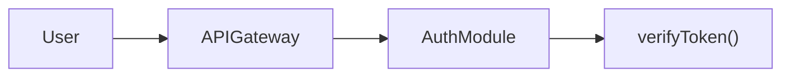
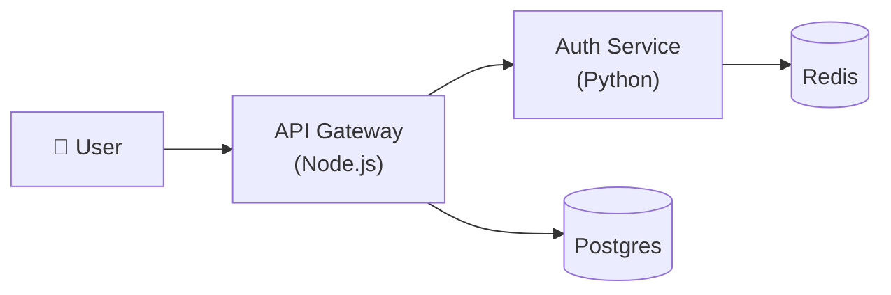
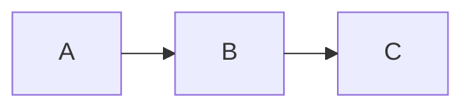
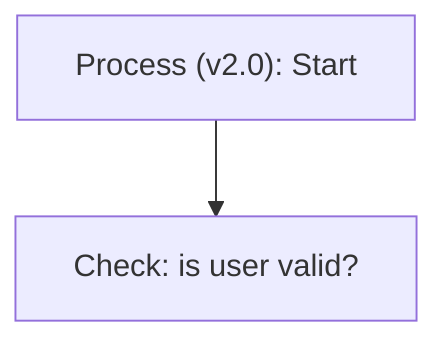
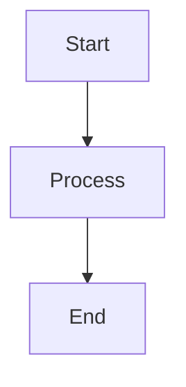
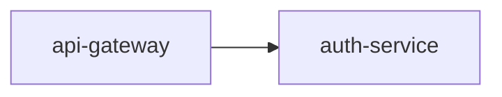
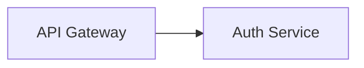
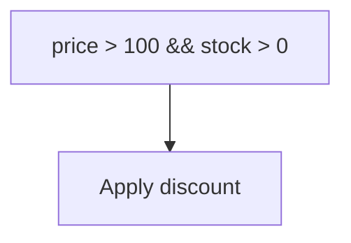
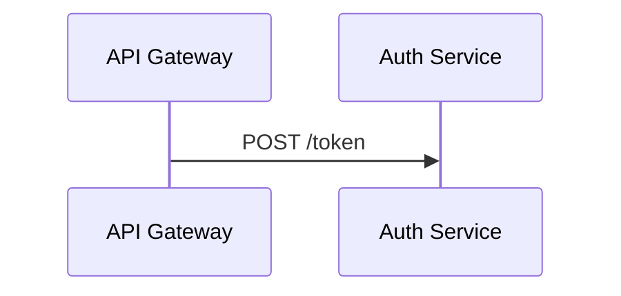

# Mermaid

> Load this skill before writing ANY Mermaid diagram. Your three jobs:
> 1. Pick the right **type** for the intent.
> 2. Set the right **depth** (abstraction level) — never mix levels.
> 3. Produce **safe, readable syntax** — quote labels, avoid reserved words, respect size caps.

---

## Step 1 — Type Selection

Match the user's intent to a diagram type. Use the first match.

```
What is the primary question the diagram answers?
│
├── "What order do things happen in?" / "How do services talk?"
│   └── sequenceDiagram
│
├── "What are the decision paths / steps in a process?"
│   └── flowchart TD   (or LR for horizontal pipelines)
│
├── "What is the high-level system architecture / infra topology?"
│   └── flowchart LR   (stable, use over architecture-beta)
│
├── "How are services / containers organised in this system?"
│   └── flowchart LR   (C4 Container level, label each node with its type)
│
├── "What is the database schema / table relationships?"
│   └── erDiagram
│
├── "What are the classes / types and their relationships?"
│   └── classDiagram
│
├── "What are the states and transitions?"
│   └── stateDiagram-v2
│
├── "What is the git branching strategy?"
│   └── gitGraph
│
├── "What are the concepts / topics / features?" (brainstorm map)
│   └── mindmap
│
├── "What is the project schedule / phases?"
│   └── gantt
│
├── "How should items be prioritised?" (2×2 matrix)
│   └── quadrantChart
│
├── "What is the timeline of events?"
│   └── timeline
│
├── "How do flow volumes relate?" (Sankey / proportional)
│   └── sankey-beta
│
└── "What proportion of the whole?" (single metric)
    └── pie
```

**Tiebreaker rules:**
- Structural ("what exists") → `classDiagram` or `flowchart LR`
- Behavioral ("what happens") → `sequenceDiagram` or `flowchart TD`
- When in doubt between flowchart and sequence: if time/ordering is the core message → sequence; if branching logic is → flowchart.

---

## Step 2 — Abstraction Level (C4 Protocol)

**Rule: pick one level and stay there. Never mix.**

| Level | What to show | Node examples | Diagram type |
|---|---|---|---|
| L1 System Context | Your system + external users + external systems | `User`, `YourApp`, `Stripe`, `SendGrid` | `flowchart LR` or `C4Context` |
| L2 Container | Services, databases, queues, frontends inside your system | `API Gateway`, `Postgres`, `Redis`, `React App` | `flowchart LR` |
| L3 Component | Modules/packages inside one service | `AuthModule`, `OrderService`, `PaymentProcessor` | `flowchart LR` or `classDiagram` |
| L4 Code | Classes, interfaces, their methods | `class User`, `+login()`, `+logout()` | `classDiagram` only |

**Detecting the right level:**
- User asks "how does the system work overall" → L1
- User asks "what services / containers / databases are there" → L2
- User asks "what's inside service X" → L3
- User asks "show the class structure" → L4

**Violation example:**




---

## Step 3 — Layout Direction & Engine

### Direction (flowchart / graph)

| Direction | Use when |
|---|---|
| `TD` (top-down) | Decision trees, process flows, CI/CD steps, state transitions shown as flow |
| `LR` (left-right) | Pipelines, data flows, system architecture, horizontal timelines of services |
| `BT` (bottom-up) | Rarely useful — avoid unless user asks |
| `RL` (right-left) | Avoid |

**Default**: use `TD` for process/decision, `LR` for architecture/data-flow.

### Layout engine (YAML config frontmatter)

Add a config block at the top of the diagram when the default isn't right:



| Engine | When to use |
|---|---|
| `elk` | Complex diagrams with many edges, deeply nested subgraphs, want orthogonal routing. **Default in v12+.** |
| `dagre` | Simple flowcharts, fast rendering, legacy compatibility. Use if elk produces ugly overlaps on small graphs. |
| `cose-bilkent` | Force-directed graphs where edge crossing minimisation matters more than orthogonal paths. |
| `tidy-tree` | Strict trees with no cycles (org charts, taxonomies). |

**Decision:** ≤ 10 nodes → `dagre`; 11–30 nodes → `elk` (default); > 30 nodes → split the diagram first, then elk.

---

## Step 4 — Syntax Safety Rules

### 4.1 Quote labels that contain special characters

Any label with `()`, `:`, `,`, `/`, `-`, `&`, `<`, `>`, `.`, `'` must be wrapped in double quotes.

```mermaid
%% ❌ WRONG — unquoted special chars break the parser
flowchart TD
    A(Process (v2.0): Start) --> B[Check: is user valid?]
```



### 4.2 Never use `end` as a node ID

`end` closes subgraphs and loop blocks — it is a reserved keyword.

```mermaid
%% ❌ WRONG
flowchart TD
    start --> process --> end
```



### 4.3 Keep node IDs short and alphanumeric

Node IDs are internal references. Labels are what gets displayed.





### 4.4 HTML entities for characters that break parser inside quotes

| Character | Entity |
|---|---|
| `"` | `#quot;` |
| `;` | `#59;` |
| `&` | `#amp;` |
| `<` | `#lt;` |
| `>` | `#gt;` |



### 4.5 Subgraph labels must be quoted if they contain spaces

```mermaid
%% ❌ WRONG
subgraph Auth Module
```

```mermaid
%% ✅ CORRECT
subgraph authmod["Auth Module"]
```

### 4.6 Sequence diagram participant names with spaces




---

## Step 5 — Readability Caps

**When a diagram exceeds these limits, split it — do not squeeze.**

| Diagram type | Node / participant limit | Message / edge limit | Split strategy |
|---|---|---|---|
| `flowchart` | 20 nodes | 25 edges | Split by subgraph / layer; one diagram per C4 level |
| `sequenceDiagram` | 6 participants | 20 messages | Split by use case or feature boundary |
| `classDiagram` | 12 classes | — | Split by package / module |
| `erDiagram` | 10 entities | — | Split by domain aggregate |
| `stateDiagram-v2` | 15 states | — | Split by sub-state region |
| `mindmap` | depth ≤ 3 | — | Flatten or promote sub-topics to their own mindmap |

**Splitting pattern for flowcharts:**
```
docs/
  architecture.md          ← L1 System Context (the overview)
  architecture-containers.md  ← L2 Container map
  architecture-<service>.md   ← L3 Component detail per service
```

---

## Step 6 — File Placement

| Scenario | Where to write / update |
|---|---|
| Project-level architecture update | `<EXECUTION_DIR>/docs/architecture.md` (required by AGENTS.md) |
| New C4 level for an existing system | New file: `docs/architecture-<level>.md` (e.g. `architecture-containers.md`) |
| Module / service internal diagram | `<EXECUTION_DIR>/docs/<service-name>.md` |
| ADR-embedded diagram | Inline in `<EXECUTION_DIR>/.planning/research/ADR-XXX.md` |
| Scratch / draft diagram | `<EXECUTION_DIR>/.planning/<date-slug>/diagram-draft.md` |

**Rule:** never create a new file without first checking whether an existing file already contains a diagram for the same scope. Grep for `mermaid` under `docs/` and `<EXECUTION_DIR>/.planning/` first.

---

## Step 7 — Validation Checklist (run before outputting)

Before producing the final diagram, check every item:

- [ ] **Type match** — diagram type matches the user's intent (re-read Step 1)
- [ ] **Single abstraction level** — no mixing of L1/L2/L3/L4 nodes in one diagram
- [ ] **Labels quoted** — every label with `()`, `:`, `,`, `/`, `-` is wrapped in `"..."`
- [ ] **No `end` node IDs** — replaced with `FIN`, `done`, `END`, etc.
- [ ] **Node IDs alphanumeric** — no hyphens, dots, spaces in IDs
- [ ] **Size within cap** — node/participant/entity count is within the limit for this type
- [ ] **Layout engine set** — config frontmatter present if non-default engine needed
- [ ] **Direction chosen** — `TD` for process/decision, `LR` for architecture/pipeline
- [ ] **Subgraph labels quoted** — every `subgraph` with a space in the label uses `["..."]`
- [ ] **Sequence aliases** — multi-word participants use `participant X as Long Name`
- [ ] **File target identified** — know which file this goes into before outputting

---

## Anti-patterns (summary)

| Anti-pattern | Why it's wrong | Fix |
|---|---|---|
| Using `graph TD` instead of `flowchart TD` | `graph` is deprecated syntax | Always use `flowchart` |
| Unquoted labels with `(` or `:` | Parser breaks silently | Quote the label |
| 40-node flowchart | Unreadable, defeats the purpose | Split into sub-diagrams |
| Mixing system actors with internal classes | Violates abstraction level — audience can't reason about it | Pick one C4 level |
| `end` as node ID | Reserved keyword | Use `FIN` or `done` |
| Forgetting `participant` aliases in sequence diagrams | Multi-word names break arrow syntax | Always declare participants |
